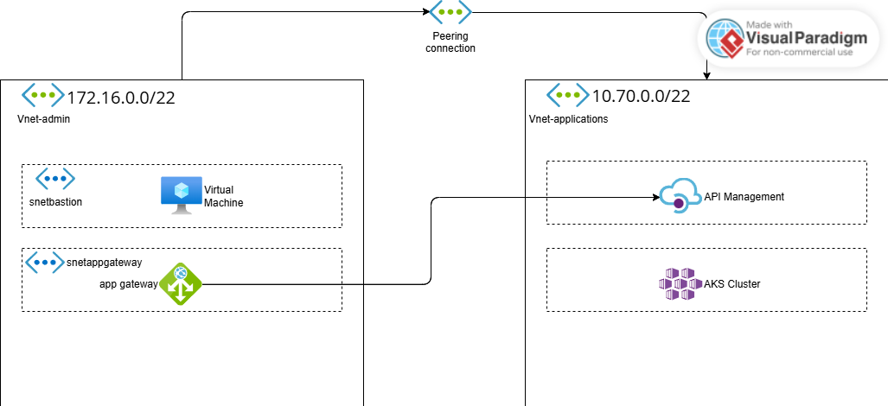

# Diagrama a implementar

The architectura doesn't have to make sense at all, this project is only for learning purposes

For this project the cluster definition will be the following:

We will have a namespace named test with some deployments like nginx, azure CNI overlay as a network plugin and Azure network policy enable. 